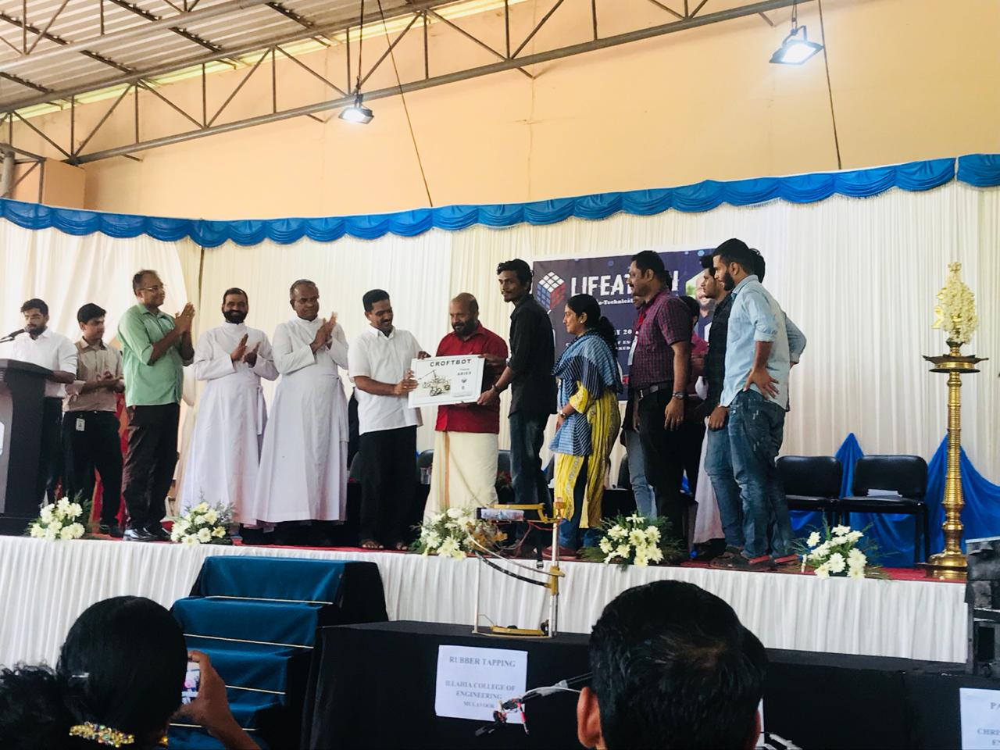

With the global population expected to reach a 9 billion by 2050, agricultural production must double to meet the demand.The farmers are under pressure to feed more people. With youth turning away from this profession, there is also less labour available to drive the vision forward. Here comes the use of agricultural robot.

Agrobo is a multi-purpose semi-autonomus rover to assist the farmers in tasks like sapling/seed plantation, area mapping, soil analysis and crop maintenance.Using the drill mechanism it will help the farmers in ploughing. A modular feed system is designed so that it can be attached to the rover that will help in planting the sapling. Sensors present in the rover will help for soil analysis.

## WORKING

## ACHIEVEMENTS

Lifeathon- a socio economic hackathon was the event that brought AgRobo to life. A funding of Rs 20,000/- was received for the development of the prototype. Being one of the winners of Lifeathon, we were selected for the Idea fest which was conducted by Kerala Startup Mission. We were again awarded with Rs 25,000/- for further development of the product. We were then selected for a program called "Fail fast or Succeed Program" which was conducted by the Kerala Startup Mission. We were assigned two mentors for turning the prototype into a product.

